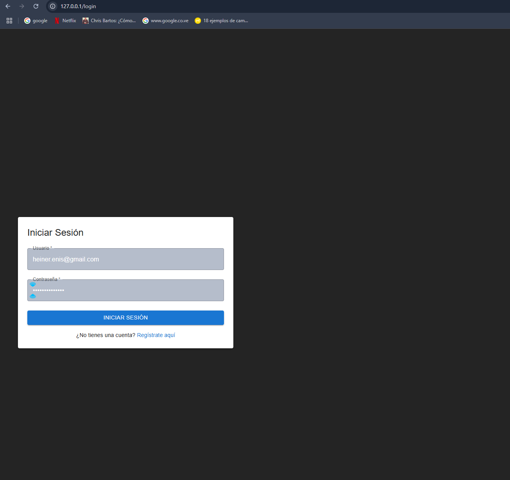
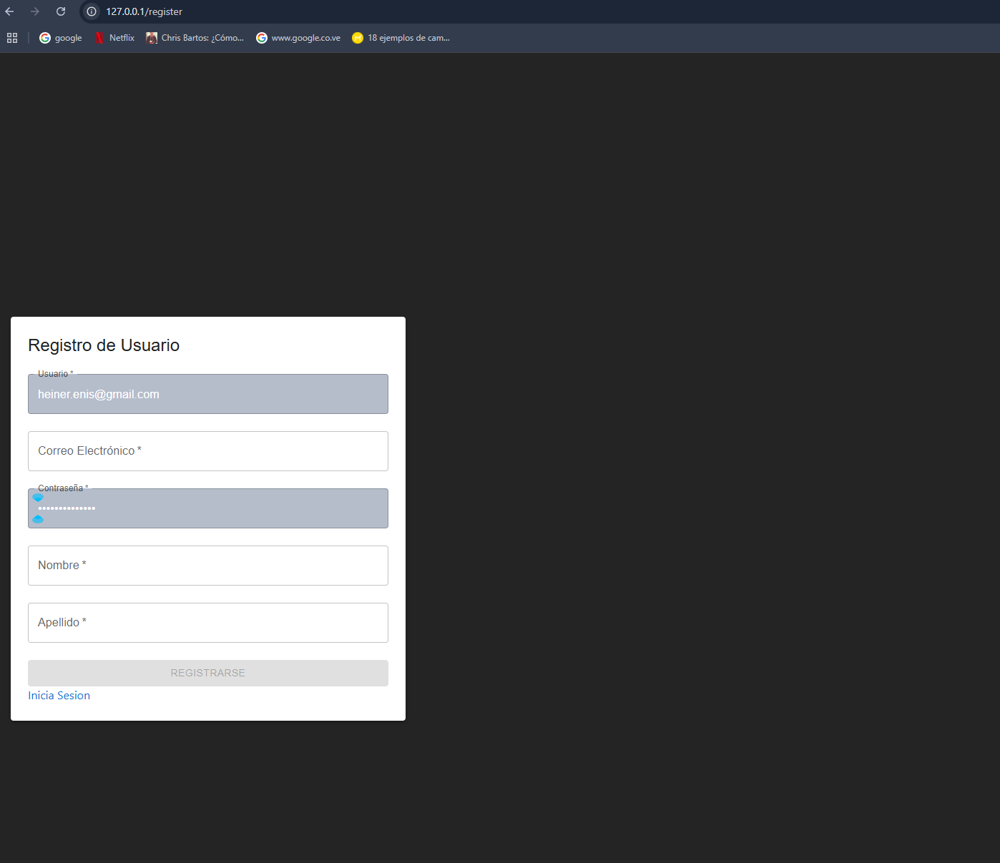

### Introduccion

El frontend lo puedes ubicar en: ```http://127.0.0.1/``` o ```http://localhost/```

Este tiene comunicacion con el backend y posee 3 paginas: Login, Registro y Home

* Login: Estableceras tus credenciales de acceso mediante un formulario el cual envia tu informacion al servidor y el mismo al procesarla, impactara contra la db y devolvera el token asignado al usuario, dandole acceso a la plataforma.


* Register: En caso de no tener usuario, accede al link de registrarse debajo del formulario de login y veras un formulario que te pedira:
- Nombre de usuario
- Clave
- Correo electronico
- Nombre
- Apellido

Una vez que te registres, automaticamente te loguearas y redirigiras a la home.



* Home: Es la vista principal del proyecto en donde podras:
- Agregar tareas.
- Marcarlas como completadas.
- Filtrar por una variedad de campos
- Eliminar tareas


