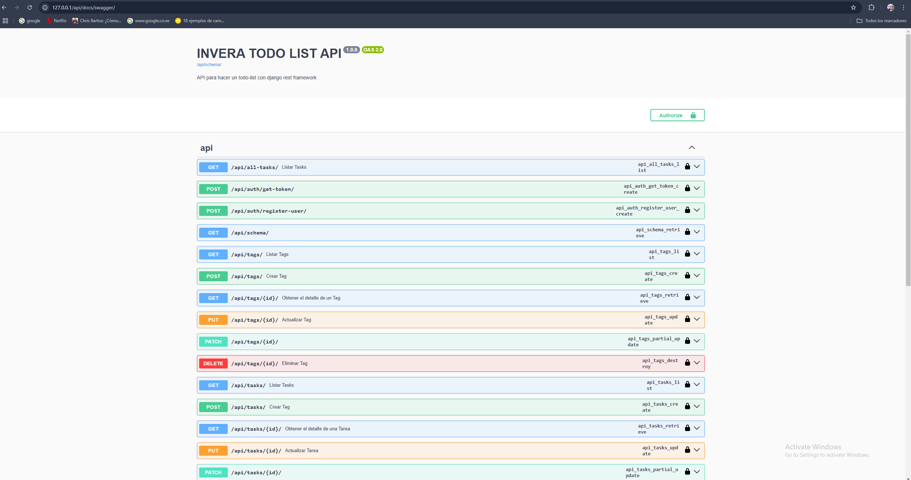
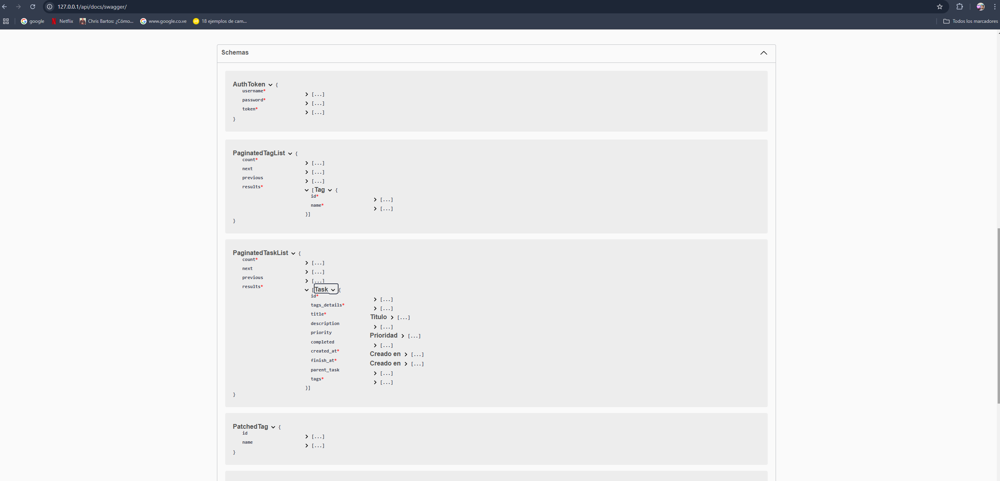

### API

TODO Challenge consta con una API la cual administra 3 objetos distintos pero relacionados, estos son:

- **Usuarios** (Registro y Login)
- **Tags**: Categorias de tareas y son unicas por usuario
- **Tasks**: Tareas y estan relacionadas a usuarios y Tags

*Nota*: La documentacion completa de la api la puedes conseguir en:
http://127.0.0.1/api/docs/swagger o http://127.0.0.1/api/docs/redoc

En las direcciones pasadas anteriormente, se pueden visualizar todos los modelos involucrados en la API, asi mismo cada uno de los endpoints existente:

*Vista de servicios*

*Visualizacion de esquemas*